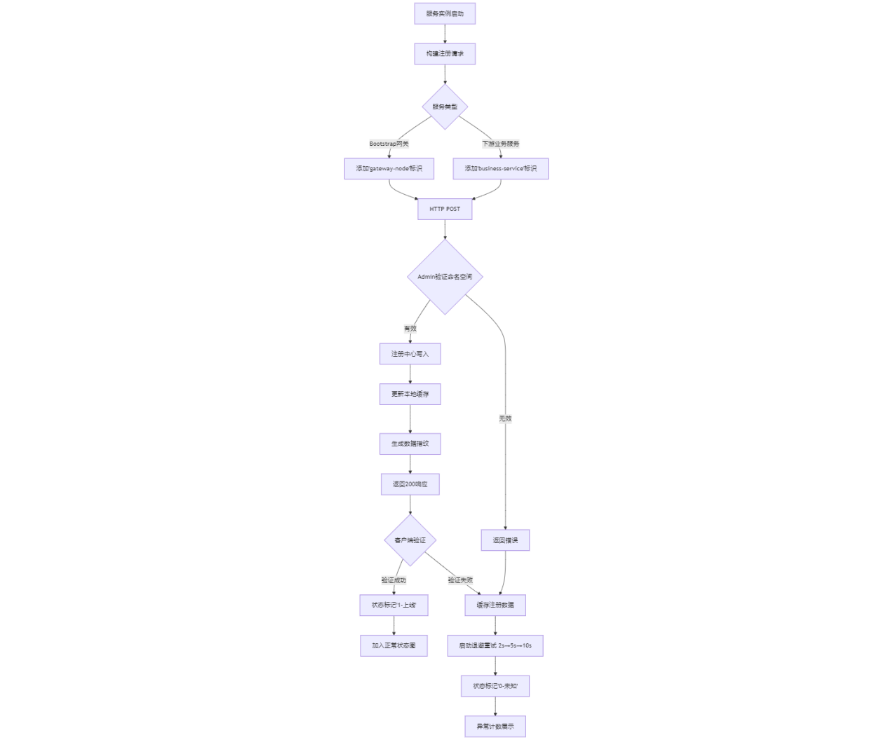
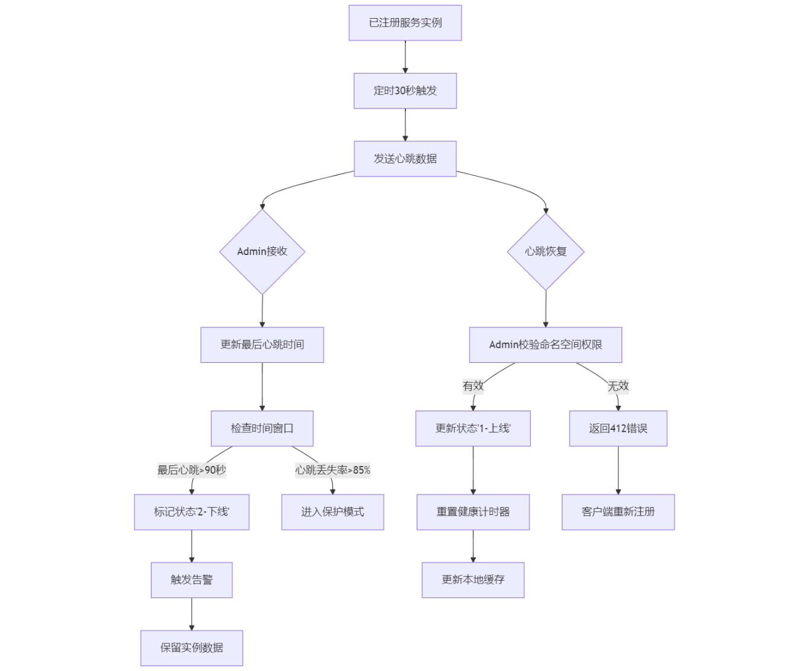
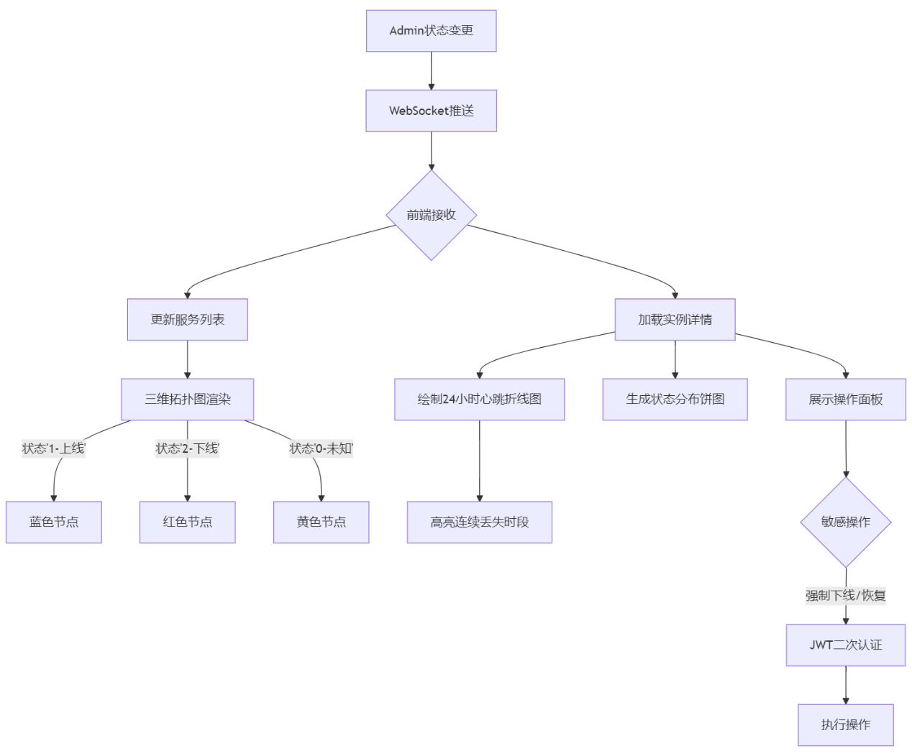
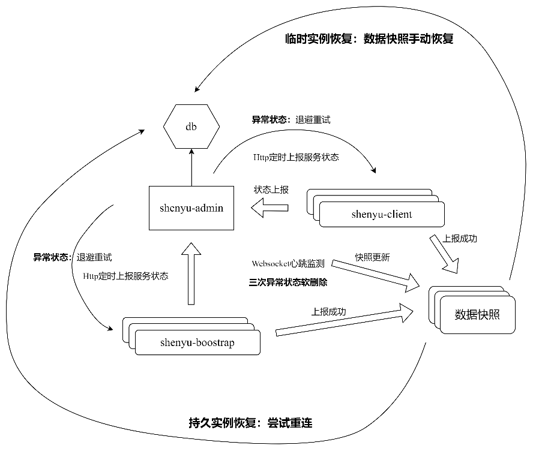
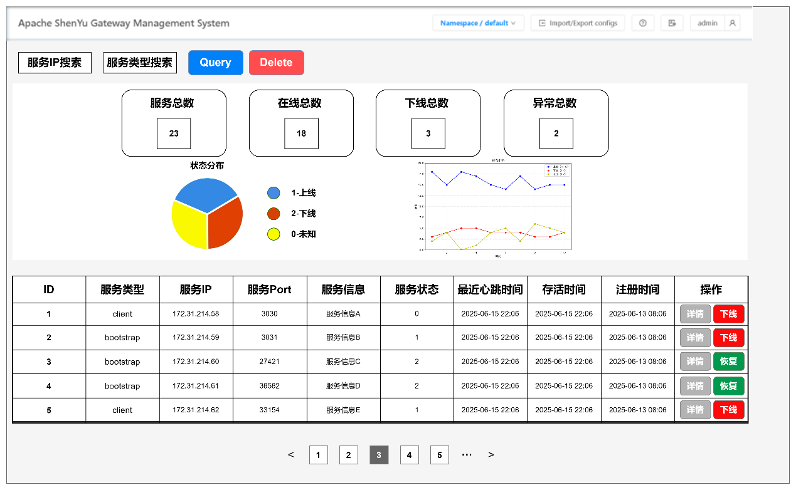

## **一、项目背景** 

	Apache ShenYu作为一款高性能、可扩展的微服务API网关，其Admin模块在协调网关与下游服务方面扮演着核心角色。随着社区生态的不断发展，越来越多的客户端服务接入ShenYu网关体系，但当前Admin对下游服务的管理能力仍存在明显不足，特别是在可视化运维层面缺乏系统性的支持。
	目前系统虽然已经针对网关节点开发了部分状态监控功能，但对于更广泛的下游服务集群却缺乏有效的可视化管控手段。运维人员难以直观掌握注册服务的实时状态分布，也无法通过管理界面快速执行服务上下线等关键操作。这种管理能力的缺失不仅增加了日常运维的复杂度，也使得故障排查和服务治理变得效率低下。
	在实际生产环境中，服务实例的动态变化是常态，突发性故障和服务伸缩都需要及时响应。现有的管理方式过度依赖命令行和日志排查，这种状况与云原生时代可视化运维的发展趋势已不相适应。特别是在大规模部署场景下，缺乏全局视角的服务状态展示会显著增加系统的不确定性风险。
	本方案的目的正是为了解决这一关键痛点，通过构建完整的服务状态可视化管理体系，为ShenYu Admin赋予更强大的服务治理能力。这不仅包括基础的服务状态监控，还将涵盖服务生命周期管理、健康度评估和异常告警等核心功能，最终形成从网关到下游服务的端到端可视化管控方案。这一改进将大幅提升ShenYu在复杂微服务场景下的运维效率和系统可靠性，为社区用户带来更优质的使用体验。

## **二、项目相关仓库及其资料** 

Apache ShenYu 仓库： 

- 前端 https://github.com/apache/shenyu-dashboard 

- 后端 https://github.com/apache/shenyu 
- 文档 https://github.com/apache/shenyu-website

## **三、项目详细方案**

### **功能简述** 

服务注册与状态上报通过HTTP接口实现。下游服务启动时向Admin的注册端点提交JSON格式注册信息，包含服务名、命名空间、IP、端口、服务类型、服务信息（JSON格式）、服务状态等核心元数据。每次HTTP上报需包含请求ID和时间戳，客户端通过校验响应状态码及返回的校验哈希值确认上报成功。若出现上传异常，客户端采用指数退避策略重试，同时更改服务状态为“0-未知”。通过状态可视化模块记录异常任务数量，便于管理者对异常任务的主动管理。

心跳监测通过定时调用心跳监测接口实现，上报内容精简为实例ID和当前负载指标。当Admin连续3次未收到心跳（默认90秒），将实例状态标记为"2-下线"并触发告警，但暂不剔除实例。服务恢复后重新发送心跳时，Admin会校验实例注册状态：若存在于注册表则立即更新为"1-上线"状态并重置计时器；若已被剔除则要求客户端重新发起注册流程。

状态可视化模块通过WebSocket实现数据实时推送。服务列表接口返回所有实例的聚合状态，前端根据状态码渲染不同颜色标识。详情页展示最近24小时心跳到达率折线图，异常时段自动高亮标记。所有HTTP通信均采用双向认证，关键操作如强制下线需通过JWT令牌二次验证。

### 详细设计

### **1.服务注册**

```
在Apache ShenYu生态系统中，Bootstrap网关节点与下游业务服务在启动时均需通过标准化注册流程接入Admin管理中心。服务实例通过HTTP协议向端点发起注册请求，提交包含多维元数据的JSON负载。核心注册字段涵盖服务名、命名空间、IP地址、服务端口、服务类型等基础标识。
注册过程采用双向验证机制保障数据完整性：客户端生成含时间戳和UUID的请求签名，服务端响应时返回数据指纹校验码。当Bootstrap网关实例注册时，自动附加“gateway-node”服务类型标识，与下游业务服务的“business-service”形成区分。Admin接收到注册请求后，首先验证命名空间合法性，随后在注册中心完成状态信息注册。完成注册后，将最新的注册数据保存到本地缓存中，以便异常恢复时，提供数据校验。
异常场景下建立分级处理流程：若网络中断导致注册失败，客户端自动缓存注册数据并切换为退避重试模式（2s→5s→10s），服务状态标记为“0-未知”状态。Admin控制台实时展示各命名空间的异常注册计数，并在状态可视化模块可视化显示异常服务的内容。当服务实例重复注册时（相同命名空间+服务名+IP+端口），Admin执行配置合并操作，保留最新服务信息数据并返回状态码通知客户端更新本地缓存。成功注册的实例将动态加入服务状态正常图，用户可通过命名空间维度实时查看网关节点与下游服务的存活分布。
```



### **2.健康检查与心跳机制**

```
服务实例（包括Bootstrap及下游服务）在成功注册后，将启动周期性心跳维护机制。每30秒向Admin端点发送结构化心跳数据，内容包含实例ID、命名空间、当前时间戳。并且每次成功更新注册表数据的同时，对本地的注册数据同步更新。
当某实例连续90秒未更新心跳（即3个检测周期缺失），系统不会立即剔除实例，而是启动分层处理流程：首先将实例状态标记为“2-下线”。当超过85%的心跳丢失时，进入保护模式，保留所有实例信息不剔除。恢复机制中注册表校验的"软删除"设计，既保证数据一致性又避免误剔除。
对于心跳恢复的实例，系统结合临时实例恢复与持久实例恢复两种方式结合：对于临时实例恢复方式，加载最近更新的本地注册数据，进行实例恢复；对于持久实例恢复方式，客户端尝试重新连接，当重新收到有效心跳时，立即校验实例的命名空间权限和注册元数据。验证通过后将状态升级为“1-上线”。此外还可以通过手动强制恢复的方式实现服务的状态更新，默认使用临时实例恢复方式。
```



### **3.状态展示**

```
状态可视化模块通过WebSocket建立双向实时通信通道，服务状态变更时Admin主动推送增量更新数据。服务列表接口返回按命名空间分组的实例聚合数据，前端根据状态码渲染三维拓扑图：“1-上线”显示蓝色节点，“2-下线”显示红色节点，“0-未知”呈现黄色预警状态。
实例详情页集成多维度监控面板：核心区域展示最近24小时心跳到达率折线图，自动标记连续丢失时段为红色高亮区；选择饼状图可视化服务的状态分布情况。强制下线和本地恢复等敏感操作需通过JWT令牌二次认证。
```



### **设计流程图**



### **功能原型设计**


